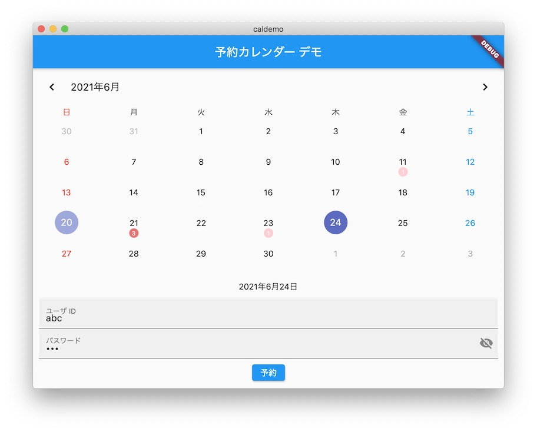

# Booking Calendar Demo

This is a simple demonstration of a booking calendar.
Currently it uses Flutter 2.2.2/Dart 2.13.3 on macOS 10.15.7 and runs as a macOS app, iOS app and Web app.  It should run on any Flutters of the same version on any platforms.

It consists of three files mainly:

- [calendar.dart](caldemo/lib/calendar.dart) implements a booking calendar with [table_calendar](https://github.com/aleksanderwozniak/table_calendar).  It runs for any locales.

- [main.dart](caldemo/lib/main.dart) implents a demo application using calendar.dart and bookings.dart.  It runs for Japanese locale for now.

- [bookings.dart](caldemo/lib/bookings.dart) implements a dummy database.  You have to rewrite this file totally to make the demo a real application.
